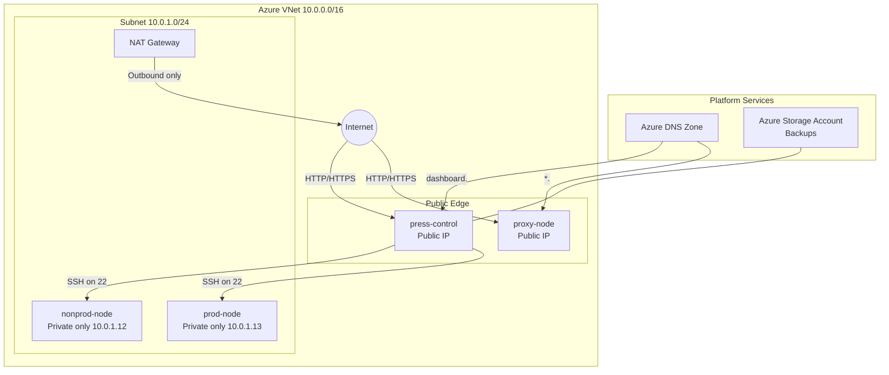

# Frappe Cloud on Azure (Terraform)

This repository provisions a multi-node Frappe/ERPNext-style infrastructure on Microsoft Azure using Terraform.

## What This Deploys

- Azure Resource Group
- Virtual Network and Subnet
- 4 Linux VMs (Ubuntu 22.04 LTS)
- Public IPs only for `press-control` and `proxy-node`
- Private NIC-only access for `nonprod-node` and `prod-node`
- Network Security Group with inbound rules for SSH/HTTP/HTTPS
- NAT Gateway for outbound internet from private nodes
- Azure DNS Zone and A records
- Azure Storage Account + private container for backups
- Terraform-managed SSH key pair for control-to-worker access

## Node Topology

The compute layout is defined in `compute.tf`:

- `press-control` -> `Standard_B2s` -> `10.0.1.10`
- `proxy-node` -> `Standard_B1s` -> `10.0.1.11`
- `nonprod-node` -> `Standard_D2s_v3` -> `10.0.1.12`
- `prod-node` -> `Standard_D4s_v3` -> `10.0.1.13`

## Architecture Diagram



## File Overview

- `providers.tf`: Terraform + Azure provider requirements
- `variables.tf`: configurable inputs
- `main.tf`: resource group, networking, storage account, storage container
- `nsg.tf`: NSG security rules
- `compute.tf`: public IPs, NICs, NSG associations, VMs, generated SSH key logic, cloud-init sudo setup
- `keys.tf`: optional local SSH key generation helper
- `setup_control.sh`: bootstrap script template for zero-touch Press setup on `press-control`
- `terraform.tfvars.example`: safe example input file with placeholder values
- `dns.tf`: DNS zone and records
- `outputs.tf`: important deployment outputs

## Prerequisites

- Terraform v1.5+ (recommended)
- Azure subscription with permissions to create:
  - Resource groups
  - Networking resources
  - VMs
  - DNS zone
  - Storage account
- Azure CLI logged in:

```bash
az login
az account set --subscription "<your-subscription-id-or-name>"
```

- SSH public key file available locally (default path in this repo is `C:/Users/SagarMemane/.ssh/id_ed25519.pub`)

## Inputs (Variables)

Defaults are defined in `variables.tf`:

- `resource_group_name` (default: `myfrappe-cloud-rg`)
- `location` (default: `centralindia`)
- `admin_username` (default: `frappeadmin`)
- `ssh_public_key_path` (default: `C:/Users/SagarMemane/.ssh/id_ed25519.pub`)
- `root_domain` (default: `cogniticon.in`)
- `db_root_password` (required, sensitive)
- `site_admin_password` (required, sensitive)

You can override values with a `terraform.tfvars` file.

Start from `terraform.tfvars.example` and copy it to `terraform.tfvars` before editing real values.

Example:

```hcl
resource_group_name = "myfrappe-prod-rg"
location            = "centralindia"
admin_username      = "frappeadmin"
ssh_public_key_path = "C:/Users/SagarMemane/.ssh/id_ed25519.pub"
root_domain         = "example.com"
db_root_password    = "replace-with-strong-password"
site_admin_password = "replace-with-strong-password"
```

## Zero-Touch Control Bootstrap

`press-control` uses `templatefile("setup_control.sh", ...)` during VM creation. The script:

- Writes the generated control-to-workers private key to `/home/<admin_username>/.ssh/worker_access_key`
- Enables passwordless sudo for the admin user
- Installs core dependencies (Python, MariaDB, Redis, Node.js, Nginx)
- Installs Bench CLI and initializes `press-bench`
- Clones Press app and attempts site creation for `dashboard.<root_domain>`

Other nodes keep lightweight cloud-init and receive only the shared control public key.

Monitor bootstrap progress on control node:

```bash
tail -f /var/log/user-data.log
```

## SSH Access Model (Control -> Workers)

This stack solves the control-node key bootstrapping problem by generating an SSH key pair in Terraform:

- Terraform creates an in-memory key pair using `tls_private_key.control_to_workers`.
- Public key is injected into `proxy-node`, `nonprod-node`, and `prod-node` via a conditional `admin_ssh_key` block.
- Private key is written only on `press-control` at:
  - `/home/<admin_username>/.ssh/worker_access_key`
- All nodes get passwordless sudo via cloud-init:
  - `sudo: ['ALL=(ALL) NOPASSWD:ALL']`
- Inbound SSH is open from the internet (`0.0.0.0/0`) via NSG.
- `keys.tf` creates a local helper key file at `cluster_internal_key.pem`; it is ignored by Git.

Worker SSH can still be initiated from `press-control` over the private subnet using the generated key.

From `press-control`, worker SSH examples:

```bash
ssh -i ~/.ssh/worker_access_key <admin_username>@10.0.1.11
ssh -i ~/.ssh/worker_access_key <admin_username>@10.0.1.12
ssh -i ~/.ssh/worker_access_key <admin_username>@10.0.1.13
```

## Deploy

Run from the repository root:

```bash
terraform init
terraform validate
terraform plan -out tfplan
terraform apply tfplan
```

## Outputs

After apply, Terraform returns:

- `dashboard_ip`: public IP of `press-control`
- `proxy_ip`: public IP of `proxy-node`
- `storage_account_name`: generated storage account name for backups
- `name_servers`: Azure DNS name servers (set these at your domain registrar)
- `nat_gateway_public_ip`: outbound egress IP for private subnet traffic

## DNS Behavior

- `dashboard.<root_domain>` -> points to `press-control`
- `*.<root_domain>` -> wildcard points to `proxy-node`

## Security Notes

Current NSG behavior:

- SSH (`22`) is allowed from `0.0.0.0/0`.
- HTTP (`80`) and HTTPS (`443`) remain internet-accessible.
- `prod-node` and `nonprod-node` have no public IPs.

Recommended hardening:

- Restrict HTTP/HTTPS sources if your app architecture allows it
- Restrict SSH to a trusted CIDR when possible
- Consider Azure Bastion/VPN for managed admin entry workflows
- Add OS hardening and patch automation
- Protect Terraform state. The generated private SSH key is stored in state.

## Known Caveats

- Public SSH exposure (`0.0.0.0/0`) increases brute-force and scanning risk.
- Passwordless sudo is convenient for automation but increases blast radius if user credentials are compromised.
- Ensure remote backend encryption and strict RBAC for state access.
- Keep real passwords only in `terraform.tfvars`, not in the example file or README.

## Cost and Sizing Notes

This environment includes 4 VMs and networking resources. Costs depend on:

- VM SKU and uptime
- Region
- Storage usage and egress
- Public IP and DNS resources

Review Azure pricing before production rollout.

## Destroy

To remove all created resources:

```bash
terraform destroy
```

## Troubleshooting

- SSH key read errors:
  - Ensure `ssh_public_key_path` points to a valid public key file
- DNS not resolving after deploy:
  - Confirm domain registrar is updated with `name_servers` output
  - DNS propagation can take time
- Azure quota errors:
  - Check VM family quotas in selected region
