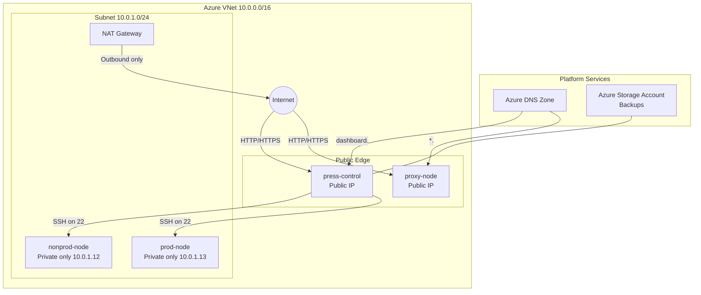

# Frappe Cloud on Azure (Terraform)


Production-grade Frappe/ERPNext infrastructure on Microsoft Azure using Terraform. Deploy a secure, multi-node Frappe Cloud setup with automatic control-to-worker SSH key distribution and zero-touch bootstrapping.

---

## 📋 Table of Contents

- [Frappe Cloud on Azure (Terraform)](#frappe-cloud-on-azure-terraform)
  - [📋 Table of Contents](#-table-of-contents)
  - [🚀 Quick Start](#-quick-start)
  - [📦 What This Deploys](#-what-this-deploys)
  - [🏗️ Architecture](#️-architecture)
  - [📋 Prerequisites](#-prerequisites)
    - [System Requirements](#system-requirements)
    - [Required Accounts \& Permissions](#required-accounts--permissions)
    - [Install Required Tools](#install-required-tools)
      - [macOS (using Homebrew)](#macos-using-homebrew)
      - [Windows (using Chocolatey)](#windows-using-chocolatey)
      - [Linux (Ubuntu/Debian)](#linux-ubuntudebian)
      - [Verify Installations](#verify-installations)
  - [Inputs (Variables)](#inputs-variables)
    - [Password Special Characters](#password-special-characters)
  - [Zero-Touch Control Bootstrap](#zero-touch-control-bootstrap)
  - [SSH Access Model (Control -\> Workers)](#ssh-access-model-control---workers)
  - [Deploy](#deploy)
  - [Outputs](#outputs)
  - [DNS Behavior](#dns-behavior)
  - [Security Notes](#security-notes)
  - [Known Caveats](#known-caveats)
  - [Cost and Sizing Notes](#cost-and-sizing-notes)
  - [Destroy](#destroy)
  - [Troubleshooting](#troubleshooting)

---

## 🚀 Quick Start

For experienced users, here's the express setup:

```bash
# 1. Clone and enter directory
git clone https://github.com/sagarmemane135/FrappeCloud-Azure-Terraform.git
cd FrappeCloud-Azure-Terraform

# 2. Ensure SSH key exists
ssh-keygen -t ed25519 -f ~/.ssh/id_ed25519 -N ""

# 3. Create variables file
cp terraform.tfvars.example terraform.tfvars
# Edit terraform.tfvars with your values

# 4. Deploy
terraform init
terraform plan -out tfplan
terraform apply tfplan

# 5. View outputs
terraform output
```

For detailed setup, see [Setup Guide](#-setup-guide) below.

---

## 📦 What This Deploys

| Component | Details |
|-----------|---------|
| **Resource Group** | Dedicated Azure RG for all resources |
| **Virtual Network** | 10.0.0.0/16 with private subnet 10.0.1.0/24 |
| **VMs (4x)** | Ubuntu 22.04 LTS with auto-bootstrap |
| **Public IPs** | press-control (B2s) & proxy-node (B1s) only |
| **Private VMs** | nonprod-node (D2s_v3) & prod-node (D4s_v3) |
| **NAT Gateway** | Outbound egress for private subnet |
| **Security** | NSG with SSH/HTTP/HTTPS inbound rules |
| **DNS** | Azure DNS zone with A records |
| **Storage** | Account + container for backups |
| **SSH Keys** | Terraform-managed control-to-worker key distribution |

---

## 🏗️ Architecture



**Key Design Points:**
- **Bastion-Style:** press-control is the SSH gateway to private nodes
- **Zero-Touch:** Control node auto-bootstraps Frappe/Press stack
- **NAT Egress:** Private nodes route outbound traffic through NAT Gateway
- **DNS:** Dashboard and wildcard subdomains point to public nodes

---

## 📋 Prerequisites

Before you begin, ensure you have:

### System Requirements
- **Operating System:** Windows, macOS, or Linux
- **Disk Space:** ~500 MB for tools and Terraform files
- **Internet Connection:** Required for Azure API calls

### Required Accounts & Permissions

1. **Azure Subscription**
   - Sign up: https://azure.microsoft.com/en-us/free/
   - Permissions needed:
     - Virtual Machine Contributor
     - Network Contributor
     - Storage Account Contributor
     - DNS Zone Contributor
   - If unsure, use **Owner** role in a test subscription

2. **Domain Name** (optional but recommended)
   - Required for SSL certificates and DNS
   - Must be controllable at domain registrar

### Install Required Tools

#### macOS (using Homebrew)
```bash
brew install terraform azure-cli git openssh
```

#### Windows (using Chocolatey)
```powershell
choco install terraform azure-cli git openssh -y
```

#### Linux (Ubuntu/Debian)
```bash
sudo apt-get update
sudo apt-get install -y terraform azure-cli git openssh-client
```

#### Verify Installations
```bash
terraform -version      # Should be v1.5+
az --version           # Should be 2.50+
git --version          # Should be 2.30+
ssh-keygen --help      # OpenSSH validation
```

## 🎯 Setup Guide

Follow these steps to deploy this stack on your machine or CI runner. Copy/paste the commands and replace placeholders where shown.

1) Generate or verify an SSH key (ed25519 recommended):

```bash
# macOS / Linux / PowerShell
ssh-keygen -t ed25519 -f ~/.ssh/id_ed25519 -N ""

# Windows CMD
ssh-keygen -t ed25519 -f %USERPROFILE%\\.ssh\\id_ed25519 -N ""
```

2) Clone repo and create `terraform.tfvars` from the example:

```bash
git clone https://github.com/sagarmemane135/FrappeCloud-Azure-Terraform.git
cd FrappeCloud-Azure-Terraform
cp terraform.tfvars.example terraform.tfvars
# Edit terraform.tfvars with your values (do NOT commit this file)
```

3) Authenticate to Azure and select subscription:

```bash
az login
az account set --subscription "<your-subscription-id-or-name>"
```

4) Initialize Terraform, review plan, and apply:

```bash
terraform init
terraform validate
terraform plan -out tfplan
terraform apply tfplan
```

5) After apply completes, read outputs and SSH into control node:

```bash
terraform output
ssh -i ~/.ssh/id_ed25519 ${admin_username}@$(terraform output -raw dashboard_ip)
sudo tail -f /var/log/user-data.log  # monitor bootstrap on control node
```

6) DNS: use `terraform output name_servers` to update your registrar nameservers for `root_domain`.

Notes:
- Keep `terraform.tfvars` local and secret. It's included in `.gitignore`.
- If you need to restrict SSH to your IP, update `nsg.tf` or add an `ssh_source_cidr` variable.
- Consider using a remote state backend (Azure Storage) before running in production.

## Inputs (Variables)

Defaults are defined in `variables.tf`:

- `resource_group_name` (default: `myfrappe-cloud-rg`)
- `location` (default: `centralindia`)
- `admin_username` (default: `frappeadmin`)
- `ssh_public_key_path` (default: `C:/Users/SagarMemane/.ssh/id_ed25519.pub`)
- `root_domain` (default: `cogniticon.in`)
- `db_root_password` (required, sensitive)
- `site_admin_password` (required, sensitive)

You can override values with a `terraform.tfvars` file.

Start from `terraform.tfvars.example` and copy it to `terraform.tfvars` before editing real values.

Example:

```hcl
resource_group_name = "myfrappe-prod-rg"
location            = "centralindia"
admin_username      = "frappeadmin"
ssh_public_key_path = "C:/Users/SagarMemane/.ssh/id_ed25519.pub"
root_domain         = "example.com"
db_root_password    = "MySecure!P@ssw0rd#2024"
site_admin_password = "AnotherStrong$Pass123!"
```

### Password Special Characters

Both `db_root_password` and `site_admin_password` support special characters, including:
- Symbols: `!@#$%^&*()_+-=[]{}|;':",.<>?/~`
- Spaces (avoid in passwords for database compatibility)

**Important:** Passwords are passed through shell escaping via Terraform `replace()` functions in `compute.tf` before injection into bootstrap commands. This ensures single quotes, backslashes, and other shell metacharacters are safely handled and will not break the bootstrap script.

**Example strong passwords:**
```
db_root_password = "Pr0d!P@ssw0rd#2024$Secure"
site_admin_password = "D@shb0ard$Admin&Secure!2024"
```

The bootstrap script uses proper quoting (`${db_root_password_shell}`) in MariaDB and Bench commands, so any special character combination is safe.

## Zero-Touch Control Bootstrap

`press-control` uses `templatefile("setup_control.sh", ...)` during VM creation. The script:

- Writes the generated control-to-workers private key to `/home/<admin_username>/.ssh/worker_access_key`
- Enables passwordless sudo for the admin user
- Installs core dependencies (Python, MariaDB, Redis, Node.js, Nginx)
- Installs Bench CLI and initializes `press-bench`
- Clones Press app and attempts site creation for `dashboard.<root_domain>`

Other nodes keep lightweight cloud-init and receive only the shared control public key.

Monitor bootstrap progress on control node:

```bash
tail -f /var/log/user-data.log
```

## SSH Access Model (Control -> Workers)

This stack solves the control-node key bootstrapping problem by generating an SSH key pair in Terraform:

- Terraform creates an in-memory key pair using `tls_private_key.control_to_workers`.
- Public key is injected into `proxy-node`, `nonprod-node`, and `prod-node` via a conditional `admin_ssh_key` block.
- Private key is written only on `press-control` at:
  - `/home/<admin_username>/.ssh/worker_access_key`
- All nodes get passwordless sudo via cloud-init:
  - `sudo: ['ALL=(ALL) NOPASSWD:ALL']`
- Inbound SSH is open from the internet (`0.0.0.0/0`) via NSG.
- `keys.tf` creates a local helper key file at `cluster_internal_key.pem`; it is ignored by Git.

Worker SSH can still be initiated from `press-control` over the private subnet using the generated key.

From `press-control`, worker SSH examples:

```bash
ssh -i ~/.ssh/worker_access_key <admin_username>@10.0.1.11
ssh -i ~/.ssh/worker_access_key <admin_username>@10.0.1.12
ssh -i ~/.ssh/worker_access_key <admin_username>@10.0.1.13
```

## Deploy

Run from the repository root:

```bash
terraform init
terraform validate
terraform plan -out tfplan
terraform apply tfplan
```

## Outputs

After apply, Terraform returns:

- `dashboard_ip`: public IP of `press-control`
- `proxy_ip`: public IP of `proxy-node`
- `storage_account_name`: generated storage account name for backups
- `name_servers`: Azure DNS name servers (set these at your domain registrar)
- `nat_gateway_public_ip`: outbound egress IP for private subnet traffic

## DNS Behavior

- `dashboard.<root_domain>` -> points to `press-control`
- `*.<root_domain>` -> wildcard points to `proxy-node`

## Security Notes

Current NSG behavior:

- SSH (`22`) is allowed from `0.0.0.0/0`.
- HTTP (`80`) and HTTPS (`443`) remain internet-accessible.
- `prod-node` and `nonprod-node` have no public IPs.

Recommended hardening:

- Restrict HTTP/HTTPS sources if your app architecture allows it
- Restrict SSH to a trusted CIDR when possible
- Consider Azure Bastion/VPN for managed admin entry workflows
- Add OS hardening and patch automation
- Protect Terraform state. The generated private SSH key is stored in state.

## Known Caveats

- Public SSH exposure (`0.0.0.0/0`) increases brute-force and scanning risk.
- Passwordless sudo is convenient for automation but increases blast radius if user credentials are compromised.
- Ensure remote backend encryption and strict RBAC for state access.
- Keep real passwords only in `terraform.tfvars`, not in the example file or README.

## Cost and Sizing Notes

This environment includes 4 VMs and networking resources. Costs depend on:

- VM SKU and uptime
- Region
- Storage usage and egress
- Public IP and DNS resources

Review Azure pricing before production rollout.

## Destroy

To remove all created resources:

```bash
terraform destroy
```

## Troubleshooting

- SSH key read errors:
  - Ensure `ssh_public_key_path` points to a valid public key file
- DNS not resolving after deploy:
  - Confirm domain registrar is updated with `name_servers` output
  - DNS propagation can take time
- Azure quota errors:
  - Check VM family quotas in selected region
